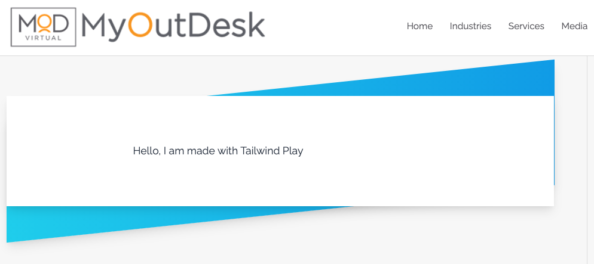

# Tailwind CSS Play To Wordpress Code
Sometimes situations come up where we need to design specific things for wordpress environments and get a quick copy-paste, one and done solution with CSS & HTML that will hopefully be respected by the themes HTML. This cuts a lot of fat out of the process by letting us write our one-offs in Tailwind and then copy paste the scoped, minified CSS & some HTML right into the wordpress editor. Your milage may vary, but we typically end up with around 5kb-ish locally. You can always serve the minified CSS alongside your wordpress theme which should put it on a CDN with brotli, making it virtually non-existent resource wise.


## Generating Code
There are two ways to generate minified and scoped CSS \ HTML

### Via Tailwind Play URL
You can automatically pull in, scope the CSS, and generate an HTML\CSS snippet with just the share code in the URL:

`nodejs index.js -c n36uNrrLBV`

This will output in terminal and also in `./out/play.html`

### Manually
You can manually generate snippets by copy pasting HTML into `./src/html/play.html` and running `npm run build`

### Example
```
node index.js -c n36uNrrLBV
Loading: n36uNrrLBV
....

// Code Shows Up Here, Copy & Paste To WP
```

And over in wordpress:



### TODO:
Read and restore the config tab from tailwind play
